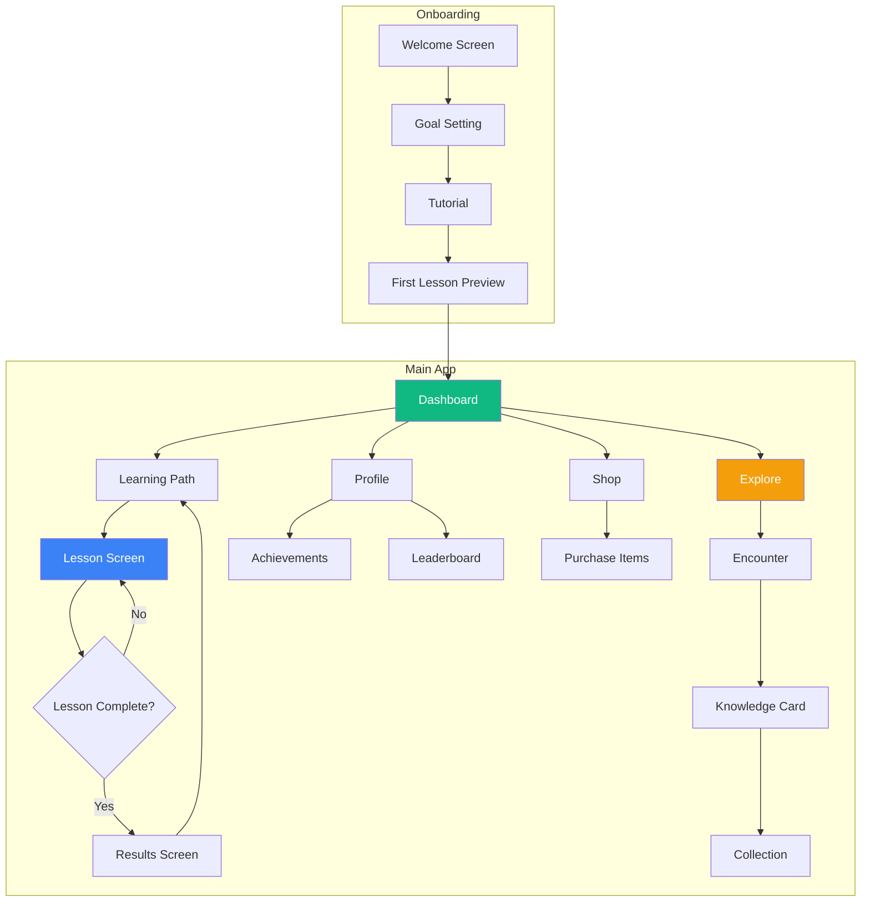

# Eco-Game Architecture Plan

## Executive Summary

Building a **Duolingo-style educational resort app** with:
- **Framework**: React 18 + Vite 5
- **State**: Zustand with persistence middleware
- **Animations**: Framer Motion
- **Audio**: Howler.js
- **Effects**: canvas-confetti
- **i18n**: react-i18next
- **Mascot**: Colorful Toucan named "Tuki"
- **Storage**: Local-first (localStorage/IndexedDB), backend-ready architecture

---

## Critical Foundation Decisions

### 1. Why These Decisions Matter

Before diving into implementation, here are the architectural decisions that will make or break this project:

| Decision | Choice | Rationale |
|----------|--------|-----------|
| **State Management** | Zustand + persist middleware | Simpler than Redux, built-in persistence, easy to migrate to backend later |
| **Styling** | Tailwind CSS + CSS Variables | Rapid development, consistent design tokens, easy theming |
| **Component Architecture** | Compound components + hooks | Reusable, testable, follows React best practices |
| **Data Layer** | Repository pattern | Abstracts storage, easy to swap localStorage for API later |
| **Animation Strategy** | Framer Motion variants | Declarative, performant, consistent animation language |
| **Audio Management** | Singleton sound manager | Preloaded sounds, no latency, easy mute control |

### 2. Backend-Ready Architecture

Even though we're starting local-first, the architecture must support easy backend migration:

```
┌─────────────────────────────────────────────────────────────┐
│                      React Components                        │
├─────────────────────────────────────────────────────────────┤
│                      Zustand Stores                          │
├─────────────────────────────────────────────────────────────┤
│                   Repository Layer                           │
│  ┌─────────────┐  ┌─────────────┐  ┌─────────────────────┐  │
│  │ UserRepo    │  │ ProgressRepo│  │ DiscoveryRepo       │  │
│  └─────────────┘  └─────────────┘  └─────────────────────┘  │
├─────────────────────────────────────────────────────────────┤
│                   Storage Adapter                            │
│  ┌─────────────────────┐  ┌─────────────────────────────┐   │
│  │ LocalStorageAdapter │  │ APIAdapter - future         │   │
│  └─────────────────────┘  └─────────────────────────────┘   │
└─────────────────────────────────────────────────────────────┘
```

---

## Project Structure

```
eco-game/
├── public/
│   ├── sounds/                    # Audio files
│   │   ├── correct.mp3
│   │   ├── wrong.mp3
│   │   ├── level-up.mp3
│   │   ├── xp-gain.mp3
│   │   ├── button-press.mp3
│   │   └── discovery.mp3
│   ├── images/
│   │   ├── mascot/               # Tuki the Toucan states
│   │   │   ├── neutral.svg
│   │   │   ├── happy.svg
│   │   │   ├── cheering.svg
│   │   │   ├── disappointed.svg
│   │   │   ├── thinking.svg
│   │   │   └── warning.svg
│   │   └── species/              # Discovery card images
│   └── locales/                  # i18n translation files
│       ├── en/
│       ├── es/
│       └── pt-BR/
│
├── src/
│   ├── main.jsx                  # App entry point
│   ├── App.jsx                   # Root component with routing
│   │
│   ├── components/
│   │   ├── ui/                   # Design system primitives
│   │   │   ├── Button.jsx
│   │   │   ├── Card.jsx
│   │   │   ├── Modal.jsx
│   │   │   ├── ProgressBar.jsx
│   │   │   ├── Badge.jsx
│   │   │   └── index.js          # Barrel export
│   │   │
│   │   ├── gamification/         # Game mechanics UI
│   │   │   ├── HeartDisplay.jsx
│   │   │   ├── StreakDisplay.jsx
│   │   │   ├── XPBar.jsx
│   │   │   ├── GemCounter.jsx
│   │   │   ├── DailyGoalRing.jsx
│   │   │   └── LeaderboardRow.jsx
│   │   │
│   │   ├── mascot/               # Tuki the Toucan
│   │   │   ├── Mascot.jsx
│   │   │   ├── MascotDialog.jsx
│   │   │   └── mascotAnimations.js
│   │   │
│   │   ├── challenges/           # Lesson challenge types
│   │   │   ├── ChallengeContainer.jsx
│   │   │   ├── MultipleChoice.jsx
│   │   │   ├── ScrambleChallenge.jsx
│   │   │   ├── MatchingChallenge.jsx
│   │   │   ├── PhotoChallenge.jsx
│   │   │   └── ListenChallenge.jsx
│   │   │
│   │   ├── exploration/          # Discovery mechanics
│   │   │   ├── ExploreButton.jsx
│   │   │   ├── EncounterReveal.jsx
│   │   │   ├── KnowledgeCard.jsx
│   │   │   └── ConditionIndicators.jsx
│   │   │
│   │   ├── learning/             # Learning path components
│   │   │   ├── UnitCard.jsx
│   │   │   ├── LessonNode.jsx
│   │   │   ├── PathConnector.jsx
│   │   │   └── MilestoneReward.jsx
│   │   │
│   │   └── layout/               # App shell components
│   │       ├── BottomNav.jsx
│   │       ├── TopBar.jsx
│   │       └── PageTransition.jsx
│   │
│   ├── screens/                  # Full page views
│   │   ├── Onboarding/
│   │   │   ├── OnboardingFlow.jsx
│   │   │   ├── WelcomeScreen.jsx
│   │   │   ├── GoalSettingScreen.jsx
│   │   │   ├── TutorialScreen.jsx
│   │   │   └── FirstLessonPreview.jsx
│   │   │
│   │   ├── Dashboard.jsx         # Main home screen
│   │   ├── LearningPath.jsx      # Unit/lesson progression
│   │   ├── LessonScreen.jsx      # Active lesson experience
│   │   ├── ExploreScreen.jsx     # Discovery mode
│   │   ├── ProfileScreen.jsx     # Stats and achievements
│   │   ├── ShopScreen.jsx        # Gem store
│   │   ├── LeaderboardScreen.jsx # Rankings
│   │   └── CollectionScreen.jsx  # Knowledge card album
│   │
│   ├── stores/                   # Zustand state management
│   │   ├── userStore.js          # XP, level, streak, hearts, gems
│   │   ├── learningStore.js      # Units, lessons, progress
│   │   ├── discoveryStore.js     # Species, encounters, conditions
│   │   ├── achievementStore.js   # Badges, milestones
│   │   ├── settingsStore.js      # Preferences, language, sound
│   │   └── index.js              # Combined store exports
│   │
│   ├── repositories/             # Data access layer
│   │   ├── adapters/
│   │   │   ├── localStorageAdapter.js
│   │   │   └── indexedDBAdapter.js
│   │   ├── userRepository.js
│   │   ├── progressRepository.js
│   │   └── discoveryRepository.js
│   │
│   ├── services/                 # Business logic
│   │   ├── spacedRepetition.js   # SRS algorithm
│   │   ├── encounterGenerator.js # Dynamic discovery
│   │   ├── xpCalculator.js       # XP and leveling
│   │   ├── streakManager.js      # Streak logic
│   │   ├── heartManager.js       # Heart regeneration
│   │   └── achievementChecker.js # Badge unlock logic
│   │
│   ├── lib/                      # Utilities and helpers
│   │   ├── soundManager.js       # Howler.js wrapper
│   │   ├── confetti.js           # canvas-confetti wrapper
│   │   ├── cardExporter.js       # PNG export for sharing
│   │   ├── dateUtils.js          # Timezone-aware date helpers
│   │   └── cn.js                 # Tailwind class merger
│   │
│   ├── hooks/                    # Custom React hooks
│   │   ├── useSound.js
│   │   ├── useConfetti.js
│   │   ├── useHeartRegeneration.js
│   │   ├── useStreakCheck.js
│   │   ├── useTimeOfDay.js
│   │   └── useReducedMotion.js
│   │
│   ├── data/                     # Static content data
│   │   ├── units.json            # Learning content structure
│   │   ├── species.json          # Discoverable species
│   │   ├── achievements.json     # Badge definitions
│   │   └── shopItems.json        # Purchasable items
│   │
│   └── styles/
│       ├── index.css             # Tailwind imports + globals
│       ├── theme.js              # Design tokens
│       └── animations.js         # Framer Motion variants
│
├── index.html
├── package.json
├── vite.config.js
├── tailwind.config.js
├── postcss.config.js
└── .env.example
```

---

## Design System Specification

### Color Tokens

```javascript
// src/styles/theme.js
export const colors = {
  // Primary - Growth, Success, Nature
  primary: {
    50: '#ecfdf5',
    100: '#d1fae5',
    200: '#a7f3d0',
    300: '#6ee7b7',
    400: '#34d399',
    500: '#10b981',  // Main primary
    600: '#059669',
    700: '#047857',
    800: '#065f46',
    900: '#064e3b',
  },
  
  // Secondary - Exploration, Discovery, Water
  secondary: {
    50: '#eff6ff',
    100: '#dbeafe',
    200: '#bfdbfe',
    300: '#93c5fd',
    400: '#60a5fa',
    500: '#3b82f6',  // Main secondary
    600: '#2563eb',
    700: '#1d4ed8',
    800: '#1e40af',
    900: '#1e3a8a',
  },
  
  // Accent - Rewards, Energy, Warmth
  accent: {
    amber: '#f59e0b',
    coral: '#fb7185',
    purple: '#a78bfa',  // Rare items
  },
  
  // Semantic
  success: '#4ade80',
  error: '#f87171',
  warning: '#fbbf24',
  
  // Neutrals
  gray: {
    50: '#f9fafb',
    100: '#f3f4f6',
    200: '#e5e7eb',
    300: '#d1d5db',
    400: '#9ca3af',
    500: '#6b7280',
    600: '#4b5563',
    700: '#374151',
    800: '#1f2937',
    900: '#111827',
  },
}
```

### Typography Scale

```javascript
export const typography = {
  fontFamily: {
    sans: ['Nunito', 'Quicksand', 'system-ui', 'sans-serif'],
  },
  fontSize: {
    xs: ['0.75rem', { lineHeight: '1rem' }],
    sm: ['0.875rem', { lineHeight: '1.25rem' }],
    base: ['1rem', { lineHeight: '1.5rem' }],
    lg: ['1.125rem', { lineHeight: '1.75rem' }],
    xl: ['1.25rem', { lineHeight: '1.75rem' }],
    '2xl': ['1.5rem', { lineHeight: '2rem' }],
    '3xl': ['1.875rem', { lineHeight: '2.25rem' }],
    '4xl': ['2.25rem', { lineHeight: '2.5rem' }],
  },
  fontWeight: {
    normal: '400',
    medium: '600',
    bold: '700',
    extrabold: '800',
  },
}
```

### Animation Variants

```javascript
// src/styles/animations.js
export const animations = {
  // Button press effect
  buttonPress: {
    tap: { scale: 0.95 },
    transition: { type: 'spring', stiffness: 400, damping: 17 }
  },
  
  // Correct answer celebration
  correctAnswer: {
    initial: { scale: 1, backgroundColor: '#ffffff' },
    animate: {
      scale: [1, 1.05, 1],
      backgroundColor: ['#ffffff', '#d1fae5', '#ffffff'],
    },
    transition: { duration: 0.4 }
  },
  
  // Wrong answer shake
  wrongAnswer: {
    animate: {
      x: [0, -10, 10, -10, 10, 0],
    },
    transition: { duration: 0.4 }
  },
  
  // Level up celebration
  levelUp: {
    initial: { scale: 0, opacity: 0, rotate: -180 },
    animate: { scale: 1, opacity: 1, rotate: 0 },
    transition: { type: 'spring', damping: 10, stiffness: 100 }
  },
  
  // Mascot bounce
  mascotBounce: {
    animate: {
      y: [0, -15, 0],
    },
    transition: { repeat: Infinity, duration: 2, ease: 'easeInOut' }
  },
  
  // Mascot cheer
  mascotCheer: {
    animate: {
      y: [0, -20, 0],
      rotate: [-5, 5, -5, 0],
    },
    transition: { repeat: 2, duration: 0.5 }
  },
  
  // Card flip reveal
  cardFlip: {
    initial: { rotateY: 180, opacity: 0 },
    animate: { rotateY: 0, opacity: 1 },
    transition: { duration: 0.6, ease: 'easeOut' }
  },
  
  // Progress bar fill
  progressFill: {
    initial: { width: 0 },
    animate: { width: '100%' },
    transition: { duration: 0.5, ease: 'easeOut' }
  },
  
  // Page transitions
  pageEnter: {
    initial: { opacity: 0, x: 20 },
    animate: { opacity: 1, x: 0 },
    exit: { opacity: 0, x: -20 },
    transition: { duration: 0.2 }
  },
  
  // Heart shake on loss
  heartShake: {
    animate: {
      scale: [1, 1.2, 0.8, 1],
      rotate: [0, -10, 10, 0],
    },
    transition: { duration: 0.3 }
  },
  
  // XP gain pop
  xpPop: {
    initial: { scale: 0, y: 20 },
    animate: { scale: 1, y: 0 },
    exit: { scale: 0, y: -20, opacity: 0 },
    transition: { type: 'spring', stiffness: 300 }
  },
}
```

---

## State Management Architecture

### User Store

```javascript
// src/stores/userStore.js
import { create } from 'zustand'
import { persist } from 'zustand/middleware'

export const useUserStore = create(
  persist(
    (set, get) => ({
      // Core stats
      xp: 0,
      level: 1,
      gems: 50,  // Starting gems
      hearts: 5,
      maxHearts: 5,
      
      // Streak data
      currentStreak: 0,
      longestStreak: 0,
      lastActivityDate: null,
      streakFreezes: 0,
      
      // Daily goals
      dailyXPGoal: 50,
      dailyXPEarned: 0,
      
      // Timestamps
      lastHeartLossTime: null,
      
      // Actions
      addXP: (amount) => set((state) => {
        const newXP = state.xp + amount
        const newLevel = calculateLevel(newXP)
        return {
          xp: newXP,
          level: newLevel,
          dailyXPEarned: state.dailyXPEarned + amount,
        }
      }),
      
      loseHeart: () => set((state) => ({
        hearts: Math.max(0, state.hearts - 1),
        lastHeartLossTime: Date.now(),
      })),
      
      regenerateHeart: () => set((state) => ({
        hearts: Math.min(state.maxHearts, state.hearts + 1),
      })),
      
      addGems: (amount) => set((state) => ({
        gems: state.gems + amount,
      })),
      
      spendGems: (amount) => set((state) => ({
        gems: Math.max(0, state.gems - amount),
      })),
      
      updateStreak: () => {
        // Called on app open and lesson completion
        // Handles streak increment, reset, and freeze logic
      },
      
      useStreakFreeze: () => set((state) => ({
        streakFreezes: Math.max(0, state.streakFreezes - 1),
      })),
      
      resetDailyProgress: () => set({ dailyXPEarned: 0 }),
    }),
    {
      name: 'eco-game-user',
    }
  )
)
```

### Learning Store

```javascript
// src/stores/learningStore.js
export const useLearningStore = create(
  persist(
    (set, get) => ({
      // Current progress
      currentUnitId: 'unit-1',
      currentLessonId: null,
      
      // Completion tracking
      completedLessons: [],
      completedUnits: [],
      
      // Spaced repetition queue
      reviewQueue: [],  // { challengeId, nextReviewDate, attemptCount }
      
      // Lesson state
      activeLessonProgress: {
        challengeIndex: 0,
        correctAnswers: 0,
        wrongAnswers: 0,
        startTime: null,
      },
      
      // Actions
      startLesson: (lessonId) => set({
        currentLessonId: lessonId,
        activeLessonProgress: {
          challengeIndex: 0,
          correctAnswers: 0,
          wrongAnswers: 0,
          startTime: Date.now(),
        },
      }),
      
      completeChallenge: (isCorrect, challengeId) => set((state) => {
        const progress = state.activeLessonProgress
        return {
          activeLessonProgress: {
            ...progress,
            challengeIndex: progress.challengeIndex + 1,
            correctAnswers: progress.correctAnswers + (isCorrect ? 1 : 0),
            wrongAnswers: progress.wrongAnswers + (isCorrect ? 0 : 1),
          },
          // Add to review queue if wrong
          reviewQueue: isCorrect 
            ? state.reviewQueue 
            : [...state.reviewQueue, {
                challengeId,
                nextReviewDate: Date.now() + 24 * 60 * 60 * 1000,
                attemptCount: 1,
              }],
        }
      }),
      
      completeLesson: (lessonId) => set((state) => ({
        completedLessons: [...state.completedLessons, lessonId],
        currentLessonId: null,
        activeLessonProgress: null,
      })),
      
      unlockUnit: (unitId) => set((state) => ({
        completedUnits: [...state.completedUnits, state.currentUnitId],
        currentUnitId: unitId,
      })),
    }),
    {
      name: 'eco-game-learning',
    }
  )
)
```

### Discovery Store

```javascript
// src/stores/discoveryStore.js
export const useDiscoveryStore = create(
  persist(
    (set, get) => ({
      // Discovered species/items
      discoveries: [],  // { speciesId, discoveredAt, rarity }
      
      // Current conditions
      timeOfDay: 'day',  // morning, day, evening, night
      weather: 'clear', // clear, cloudy, rainy
      
      // Exploration cooldown
      lastExploreTime: null,
      exploreCooldown: 30000,  // 30 seconds
      
      // Actions
      addDiscovery: (species) => set((state) => ({
        discoveries: [...state.discoveries, {
          ...species,
          discoveredAt: Date.now(),
        }],
      })),
      
      updateConditions: () => set({
        timeOfDay: calculateTimeOfDay(),
        weather: generateWeather(),
      }),
      
      setLastExploreTime: () => set({
        lastExploreTime: Date.now(),
      }),
      
      canExplore: () => {
        const state = get()
        if (!state.lastExploreTime) return true
        return Date.now() - state.lastExploreTime >= state.exploreCooldown
      },
    }),
    {
      name: 'eco-game-discovery',
    }
  )
)
```

---

## Core Algorithms

### XP and Leveling System

```javascript
// src/services/xpCalculator.js

// XP required for each level (exponential curve)
export function xpForLevel(level) {
  return Math.floor(100 * Math.pow(1.5, level - 1))
}

// Calculate level from total XP
export function calculateLevel(totalXP) {
  let level = 1
  let xpNeeded = xpForLevel(level)
  let xpAccumulated = 0
  
  while (xpAccumulated + xpNeeded <= totalXP) {
    xpAccumulated += xpNeeded
    level++
    xpNeeded = xpForLevel(level)
  }
  
  return level
}

// XP progress within current level
export function levelProgress(totalXP) {
  const level = calculateLevel(totalXP)
  let xpForPreviousLevels = 0
  
  for (let i = 1; i < level; i++) {
    xpForPreviousLevels += xpForLevel(i)
  }
  
  const xpInCurrentLevel = totalXP - xpForPreviousLevels
  const xpNeededForNextLevel = xpForLevel(level)
  
  return {
    current: xpInCurrentLevel,
    needed: xpNeededForNextLevel,
    percentage: (xpInCurrentLevel / xpNeededForNextLevel) * 100,
  }
}

// XP rewards by action
export const XP_REWARDS = {
  CORRECT_ANSWER: 10,
  PERFECT_LESSON: 25,  // Bonus for no mistakes
  LESSON_COMPLETE: 15,
  UNIT_COMPLETE: 100,
  DISCOVERY: 20,
  RARE_DISCOVERY: 50,
  STREAK_BONUS: 5,     // Per day of streak
  DAILY_GOAL: 30,
}
```

### Heart Regeneration System

```javascript
// src/services/heartManager.js

const HEART_REGEN_TIME = 30 * 60 * 1000  // 30 minutes
const MAX_HEARTS = 5
const HEART_REFILL_COST = 10  // gems

export function calculateHeartsToRegenerate(lastLossTime, currentHearts) {
  if (currentHearts >= MAX_HEARTS) return 0
  if (!lastLossTime) return 0
  
  const timeSinceLoss = Date.now() - lastLossTime
  const heartsToRegen = Math.floor(timeSinceLoss / HEART_REGEN_TIME)
  
  return Math.min(heartsToRegen, MAX_HEARTS - currentHearts)
}

export function timeUntilNextHeart(lastLossTime, currentHearts) {
  if (currentHearts >= MAX_HEARTS) return null
  if (!lastLossTime) return null
  
  const timeSinceLoss = Date.now() - lastLossTime
  const timeInCurrentCycle = timeSinceLoss % HEART_REGEN_TIME
  
  return HEART_REGEN_TIME - timeInCurrentCycle
}
```

### Streak Management

```javascript
// src/services/streakManager.js

export function checkStreak(lastActivityDate, currentStreak, hasStreakFreeze) {
  if (!lastActivityDate) {
    return { action: 'START', newStreak: 1 }
  }
  
  const now = new Date()
  const lastActivity = new Date(lastActivityDate)
  
  // Reset to start of day for comparison
  const today = new Date(now.getFullYear(), now.getMonth(), now.getDate())
  const lastDay = new Date(
    lastActivity.getFullYear(), 
    lastActivity.getMonth(), 
    lastActivity.getDate()
  )
  
  const daysDiff = Math.floor((today - lastDay) / (24 * 60 * 60 * 1000))
  
  if (daysDiff === 0) {
    // Same day - no change
    return { action: 'NONE', newStreak: currentStreak }
  }
  
  if (daysDiff === 1) {
    // Consecutive day - increment
    return { action: 'INCREMENT', newStreak: currentStreak + 1 }
  }
  
  if (daysDiff === 2 && hasStreakFreeze) {
    // Missed one day but has freeze
    return { action: 'USE_FREEZE', newStreak: currentStreak }
  }
  
  // Streak broken
  return { action: 'RESET', newStreak: 0 }
}

export function isStreakAtRisk(lastActivityDate) {
  if (!lastActivityDate) return false
  
  const now = new Date()
  const lastActivity = new Date(lastActivityDate)
  const hoursSinceActivity = (now - lastActivity) / (60 * 60 * 1000)
  
  // At risk if more than 20 hours since last activity
  return hoursSinceActivity >= 20
}
```

### Encounter Generator

```javascript
// src/services/encounterGenerator.js

export function generateEncounter(timeOfDay, weather, userLevel, discoveries) {
  // Filter species by conditions
  const available = allSpecies.filter(species => {
    // Check time availability
    if (!species.activeTime.includes(timeOfDay)) return false
    
    // Check weather preference
    if (species.weatherPreference && species.weatherPreference !== weather) {
      return Math.random() < 0.3  // 30% chance in non-preferred weather
    }
    
    return true
  })
  
  // Adjust rarity based on user level
  const levelAdjusted = available.map(species => ({
    ...species,
    weight: calculateWeight(species, userLevel, discoveries),
  }))
  
  // Weighted random selection
  return weightedRandom(levelAdjusted)
}

function calculateWeight(species, userLevel, discoveries) {
  let weight = species.baseWeight
  
  // Reduce weight for already discovered species
  const alreadyFound = discoveries.some(d => d.speciesId === species.id)
  if (alreadyFound) {
    weight *= 0.3  // 70% less likely to see again
  }
  
  // Adjust by rarity and level
  const rarityMultiplier = {
    common: 1,
    uncommon: 0.5,
    rare: 0.2,
    legendary: 0.05,
  }
  
  weight *= rarityMultiplier[species.rarity]
  
  // Higher level = better chance at rare species
  if (species.rarity === 'rare' || species.rarity === 'legendary') {
    weight *= (1 + userLevel * 0.1)
  }
  
  return weight
}
```

### Spaced Repetition System

```javascript
// src/services/spacedRepetition.js

const INTERVALS = [
  1 * 24 * 60 * 60 * 1000,   // 1 day
  3 * 24 * 60 * 60 * 1000,   // 3 days
  7 * 24 * 60 * 60 * 1000,   // 1 week
  14 * 24 * 60 * 60 * 1000,  // 2 weeks
  30 * 24 * 60 * 60 * 1000,  // 1 month
]

export function scheduleReview(challengeId, attemptCount, wasCorrect) {
  if (wasCorrect) {
    // Move to next interval
    const intervalIndex = Math.min(attemptCount, INTERVALS.length - 1)
    return {
      challengeId,
      nextReviewDate: Date.now() + INTERVALS[intervalIndex],
      attemptCount: attemptCount + 1,
    }
  } else {
    // Reset to first interval
    return {
      challengeId,
      nextReviewDate: Date.now() + INTERVALS[0],
      attemptCount: 1,
    }
  }
}

export function getDueReviews(reviewQueue) {
  const now = Date.now()
  return reviewQueue
    .filter(item => item.nextReviewDate <= now)
    .sort((a, b) => a.nextReviewDate - b.nextReviewDate)
}
```

---

## Component Architecture

### Button Component Example

```jsx
// src/components/ui/Button.jsx
import { motion } from 'framer-motion'
import { cn } from '@/lib/cn'
import { useSound } from '@/hooks/useSound'

const variants = {
  primary: 'bg-primary-500 hover:bg-primary-600 text-white',
  secondary: 'bg-secondary-500 hover:bg-secondary-600 text-white',
  outline: 'border-2 border-primary-500 text-primary-500 hover:bg-primary-50',
  ghost: 'text-gray-600 hover:bg-gray-100',
  danger: 'bg-red-500 hover:bg-red-600 text-white',
}

const sizes = {
  sm: 'px-3 py-1.5 text-sm',
  md: 'px-4 py-2 text-base',
  lg: 'px-6 py-3 text-lg',
}

export function Button({
  children,
  variant = 'primary',
  size = 'md',
  disabled = false,
  loading = false,
  className,
  onClick,
  ...props
}) {
  const { playSound } = useSound()
  
  const handleClick = (e) => {
    if (disabled || loading) return
    playSound('buttonPress')
    onClick?.(e)
  }
  
  return (
    <motion.button
      whileTap={{ scale: disabled ? 1 : 0.95 }}
      className={cn(
        'font-bold rounded-xl transition-colors',
        'focus:outline-none focus:ring-2 focus:ring-offset-2',
        'disabled:opacity-50 disabled:cursor-not-allowed',
        variants[variant],
        sizes[size],
        className
      )}
      disabled={disabled || loading}
      onClick={handleClick}
      {...props}
    >
      {loading ? (
        <span className="flex items-center gap-2">
          <LoadingSpinner size="sm" />
          Loading...
        </span>
      ) : children}
    </motion.button>
  )
}
```

### Mascot Component

```jsx
// src/components/mascot/Mascot.jsx
import { motion, AnimatePresence } from 'framer-motion'
import { animations } from '@/styles/animations'

const mascotStates = {
  neutral: '/images/mascot/neutral.svg',
  happy: '/images/mascot/happy.svg',
  cheering: '/images/mascot/cheering.svg',
  disappointed: '/images/mascot/disappointed.svg',
  thinking: '/images/mascot/thinking.svg',
  warning: '/images/mascot/warning.svg',
}

export function Mascot({ 
  state = 'neutral', 
  size = 'md',
  animate = true,
  message = null,
}) {
  const sizes = {
    sm: 'w-16 h-16',
    md: 'w-24 h-24',
    lg: 'w-32 h-32',
    xl: 'w-48 h-48',
  }
  
  const getAnimation = () => {
    switch (state) {
      case 'cheering':
        return animations.mascotCheer
      case 'warning':
        return { animate: { rotate: [-5, 5, -5, 5, 0] } }
      default:
        return animate ? animations.mascotBounce : {}
    }
  }
  
  return (
    <div className="flex flex-col items-center">
      <motion.img
        src={mascotStates[state]}
        alt="Tuki the Toucan"
        className={cn(sizes[size], 'object-contain')}
        {...getAnimation()}
      />
      
      <AnimatePresence>
        {message && (
          <motion.div
            initial={{ opacity: 0, y: 10 }}
            animate={{ opacity: 1, y: 0 }}
            exit={{ opacity: 0, y: -10 }}
            className="mt-2 px-4 py-2 bg-white rounded-xl shadow-lg"
          >
            <p className="text-gray-700 font-medium">{message}</p>
          </motion.div>
        )}
      </AnimatePresence>
    </div>
  )
}
```

---

## Screen Flow Diagram



---

## Data Models

### Unit Structure

```json
{
  "id": "unit-1",
  "title": "Welcome to Paradise",
  "description": "Get to know your tropical resort home",
  "icon": "palm-tree",
  "color": "#10b981",
  "prerequisite": null,
  "lessons": [
    {
      "id": "lesson-1-1",
      "title": "Resort Orientation",
      "description": "Learn your way around",
      "xpReward": 50,
      "challenges": [
        {
          "id": "challenge-1-1-1",
          "type": "multiple-choice",
          "question": "Where is the main restaurant located?",
          "options": [
            { "id": "a", "text": "Beach", "image": "/images/beach.jpg" },
            { "id": "b", "text": "Lobby", "image": "/images/lobby.jpg", "correct": true },
            { "id": "c", "text": "Pool", "image": "/images/pool.jpg" },
            { "id": "d", "text": "Garden", "image": "/images/garden.jpg" }
          ],
          "feedback": {
            "correct": "That is right! The main restaurant is in the lobby.",
            "incorrect": "Not quite. The main restaurant is actually in the lobby."
          }
        }
      ]
    }
  ],
  "milestoneReward": {
    "xp": 100,
    "gems": 20,
    "badge": "first-steps"
  }
}
```

### Species Data

```json
{
  "id": "species-toucan",
  "name": "Keel-billed Toucan",
  "scientificName": "Ramphastos sulfuratus",
  "description": "Known for its colorful bill, this iconic bird is our resort mascot!",
  "facts": [
    "Their bills can be up to one-third of their body length",
    "They sleep in groups of up to 6 birds in tree holes",
    "Despite its size, the bill is very light due to its hollow structure"
  ],
  "image": "/images/species/toucan.jpg",
  "rarity": "uncommon",
  "baseWeight": 50,
  "activeTime": ["morning", "day", "evening"],
  "weatherPreference": "clear",
  "habitat": "rainforest",
  "xpReward": 30
}
```

---

## Implementation Phases - Detailed Breakdown

### Phase 1: Foundation - Core Setup

| Task | Description | Priority |
|------|-------------|----------|
| Project scaffolding | Vite + React + TypeScript setup | Critical |
| Tailwind configuration | Design tokens, custom theme | Critical |
| Zustand stores | All 5 stores with persistence | Critical |
| Sound manager | Howler.js singleton setup | High |
| Base components | Button, Card, Modal, ProgressBar | Critical |
| Routing setup | React Router with lazy loading | High |

### Phase 2: Foundation - Design System

| Task | Description | Priority |
|------|-------------|----------|
| Typography components | Heading, Text, Label | High |
| Icon system | Lucide React integration | Medium |
| Animation variants | Framer Motion presets | High |
| Mascot component | Tuki with 6 states | High |
| Loading states | Skeleton, Spinner | Medium |

### Phase 3: Gamification UI

| Task | Description | Priority |
|------|-------------|----------|
| HeartDisplay | Animated hearts with shake | Critical |
| StreakDisplay | Flame icon with counter | Critical |
| XPBar | Level progress with animations | Critical |
| GemCounter | Gem balance display | High |
| DailyGoalRing | Circular progress indicator | High |

### Phase 4: Onboarding Flow

| Task | Description | Priority |
|------|-------------|----------|
| Welcome screen | Mascot intro, app purpose | Critical |
| Goal setting | Daily XP target selection | High |
| Tutorial | 3-step exploration demo | High |
| First lesson preview | Teaser of learning content | Medium |

### Phase 5: Dashboard

| Task | Description | Priority |
|------|-------------|----------|
| Top stats bar | Hearts, streak, gems | Critical |
| XP progress section | Level and progress bar | Critical |
| Explore button | Primary CTA with animation | Critical |
| Daily goal widget | Progress ring with status | High |
| Bottom navigation | Home, Learn, Profile, Shop | Critical |

### Phase 6: Learning Path

| Task | Description | Priority |
|------|-------------|----------|
| Unit cards | Expandable unit display | Critical |
| Lesson nodes | Connected path visualization | Critical |
| Progress indicators | Completion status per unit | High |
| Lock states | Visual locked/unlocked states | High |
| Milestone rewards | Unit completion celebrations | Medium |

### Phase 7: Lesson Experience

| Task | Description | Priority |
|------|-------------|----------|
| Challenge container | Wrapper with progress bar | Critical |
| Multiple choice | Image-based options | Critical |
| Scramble challenge | Drag-and-drop ordering | High |
| Matching challenge | Connect pairs | High |
| Photo challenge | Timing-based capture | Medium |
| Results screen | XP earned, mistakes review | Critical |

### Phase 8: Exploration Module

| Task | Description | Priority |
|------|-------------|----------|
| Explore button | Animated scan effect | Critical |
| Condition indicators | Time/weather display | High |
| Encounter reveal | Discovery animation | Critical |
| Knowledge card | Species info display | Critical |
| Card sharing | PNG export functionality | Medium |
| Collection gallery | Album view of discoveries | High |

### Phase 9: Profile and Shop

| Task | Description | Priority |
|------|-------------|----------|
| Stats dashboard | All user statistics | High |
| Achievement badges | Unlocked/locked display | High |
| Settings panel | Sound, language, goals | Medium |
| Shop items | Streak freeze, hearts, boosts | High |
| Purchase flow | Gem spending confirmation | High |

### Phase 10: Polish and Optimization

| Task | Description | Priority |
|------|-------------|----------|
| All micro-animations | Button press, transitions | High |
| Sound effects | All interaction sounds | High |
| Confetti celebrations | Level up, achievements | Medium |
| Error boundaries | Graceful error handling | High |
| Performance audit | Bundle size, render optimization | High |
| Accessibility audit | ARIA, keyboard nav, contrast | High |

---

## Risk Assessment

| Risk | Impact | Mitigation |
|------|--------|------------|
| Animation performance on low-end devices | High | Use `will-change`, reduce motion option, test on budget phones |
| localStorage limits - 5MB | Medium | Implement data pruning, consider IndexedDB for images |
| Timezone issues with streaks | High | Use UTC for all date comparisons, test across timezones |
| Sound loading latency | Medium | Preload critical sounds, use audio sprites |
| Large bundle size | Medium | Code splitting, lazy loading, tree shaking |
| Offline functionality gaps | Low | Service worker for critical assets, clear offline indicators |

---

## Success Criteria for MVP

1. **Functional**: User can complete onboarding and one full unit of 5 lessons
2. **Engaging**: All core gamification elements working - XP, hearts, streaks
3. **Polished**: Animations feel smooth, sounds play correctly, no jarring transitions
4. **Persistent**: Progress saves and restores correctly across sessions
5. **Responsive**: Works well on mobile devices 320px and up
6. **Accessible**: Keyboard navigable, screen reader compatible

---

## Questions Resolved

| Question | Decision |
|----------|----------|
| Backend strategy | Local-first with localStorage, backend-ready architecture |
| Existing code | Building from scratch, no Eco Explorer code to integrate |
| Content | Demo/placeholder content, customizable later |
| Mascot | Tuki the Toucan - colorful, tropical, eye-catching |

---

## Next Steps

1. **Review this plan** - Confirm architecture decisions and priorities
2. **Switch to Code mode** - Begin implementation with project scaffolding
3. **Phase 1 execution** - Set up project structure and core dependencies
4. **Iterative development** - Build, test, refine each component

---

*Plan created: January 21, 2026*
*Version: 1.0*
